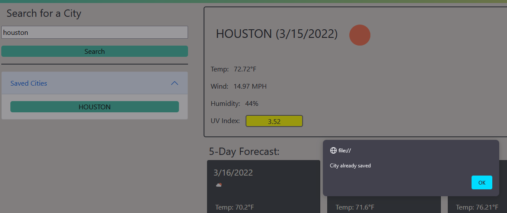

# Weather Dashboard

## What is it?

This is a weather dashboard that allows the user to search a city by name and retrieve relevant weather data for that city. It will display the current weather and date for the given city, as well as the forecasted weather for the next 5 days. The user interface is designed so that it is easy to read and understand making it a great tool for monitoring the weather of the given city.

## Purpose

Allows the user to search weather related information for a given city as well as save that information locally so it may be accessed in the future.

---

## How it works

>### Step One:
>First the user types in a city that they wish to get the weather information for
>

>### Step Two:
>Then the user clicks the search button which will queue the site to request the city and it's information
>
>
>The site will alert the user if they have searched a city that cannot be found, or if the city already exists in their list of saved cities

>### Step Three:
>The information for the searched city will display to the page
>
>The main information includes the current:
>- Icon representing weather conditions
>- Tempurature in ℉
>- Wind speed in MPH
>- Humidity as a %
>- UV Index and color codes to severity
>
>The cards underneath present the forecast for the next 5 days and include:
>- Icon representing potential weather conditions
>- Tempurature in ℉
>- Wind speed in MPH
>- Humidity as a %

---

## Deleting

>### One Step Delete
>The user can delete a city from the list of saved cities by first selecting the city by clicking it. Hovering over the city also displays brief instructions on how to delete
>
>then press the 'delete' key which will prompt the user to confirm if they wish to delete
>)

---

## Finished Product

Link to live [Weather Dashboard](https://vidalatan.github.io/weather_dashboard)

Link to [Code Repository](https://github.com/Vidalatan/weather_dashboard)